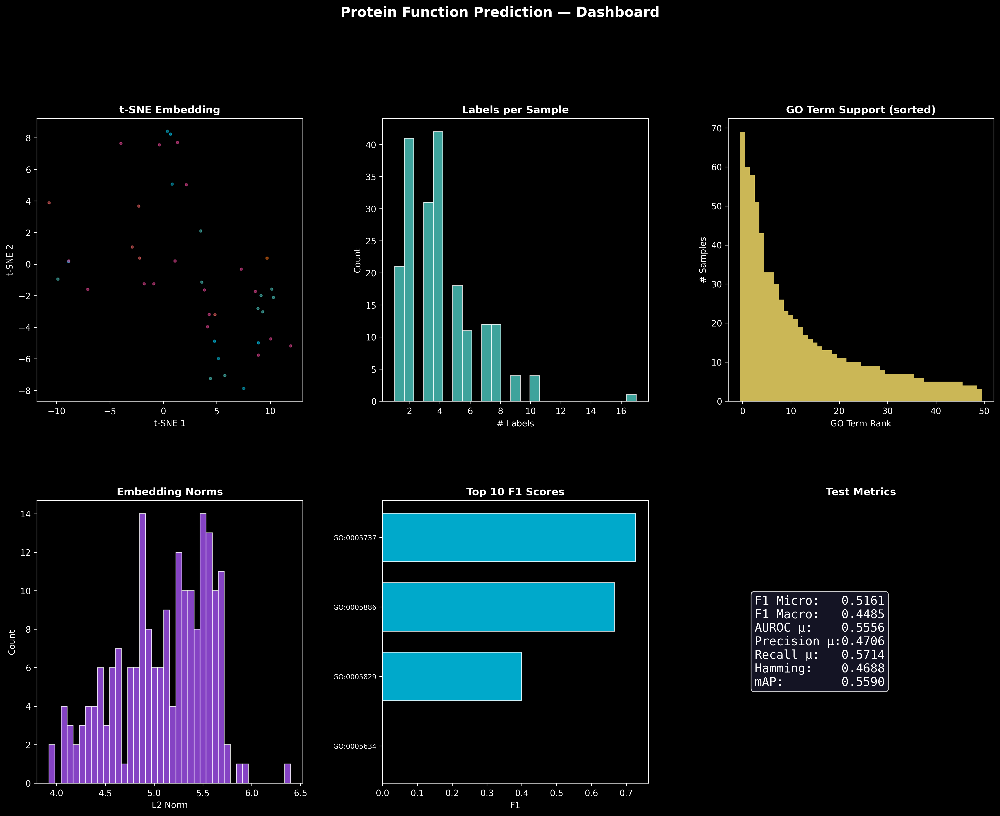

# 🧬 ProteinScope — Protein Function Predictor


> Predict protein **cellular component** GO annotations from raw amino-acid sequences
> using Facebook's **ESM-2** language model + a residual neural classifier,
> then interpret results with **Groq Kimi K2 AI**.

---

## 🖥️ Demo



---

## ✨ Features

- 🔬 **Single Sequence Prediction** — paste any amino-acid sequence and get GO term predictions instantly
- 📋 **Batch Prediction** — predict multiple sequences via multi-FASTA input
- 💬 **AI Interpreter** — chat with Groq Kimi K2 to understand your results in plain language
- 📊 **Sequence Composition** — visualize amino acid composition, charged and hydrophobic residues
- ⬇️ **Export Results** — download predictions as CSV or JSON
- 🌑 **Dark Lab UI** — clean, professional dark theme built for scientists

---

## 🧠 How It Works
```
Raw Sequence
     │
     ▼
ESM-2 (8M params)        ← Facebook's protein language model
     │  480-dim embedding
     ▼
Residual Neural Classifier  ← trained on UniProt SwissProt
     │  GO term probabilities
     ▼
Predicted GO Terms
     │
     ▼
Groq Kimi K2 AI          ← interprets results in plain language
```

### Pipeline Steps
1. **ESM-2** converts each sequence into a 480-dimensional embedding via mean pooling
2. **Residual Classifier** maps the embedding to GO Cellular Component probabilities using sigmoid output
3. **Groq Kimi K2** is seeded with prediction context to answer follow-up questions

---

## 📁 Project Structure
```
protein_function_prediction/
├── app.py                        ← main Streamlit app
├── streamlit_app.py              ← alternate entry point
├── collect_data.py               ← UniProt data collection
├── 01_preprocess.ipynb           ← data preprocessing
├── 02_feature_extraction.ipynb   ← ESM-2 embedding extraction
├── 03_train.ipynb                ← model training
├── 04_evaluate_and_results.ipynb ← evaluation & metrics
├── 05_predict.ipynb              ← prediction pipeline
├── 06_visualize.ipynb            ← result visualization
├── requirements.txt              ← dependencies
├── protein_function_project_guide.md
├── data/                         ← processed data (not pushed)
└── results/                      ← model checkpoints & plots
```

---

## 🚀 Getting Started

### 1. Clone the repo
```bash
git clone https://github.com/Avinashjoy28/protein-function-prediction.git
cd protein-function-prediction
```

### 2. Install dependencies
```bash
pip install -r requirements.txt
```

### 3. Set up API key
Create a `.env` file in the project root:
```
GROQ_API_KEY=your_groq_api_key_here
```
Get a free key at [console.groq.com](https://console.groq.com)

### 4. Train the model
Run notebooks in order:
```bash
01_preprocess.ipynb
02_feature_extraction.ipynb
03_train.ipynb
```

### 5. Launch the app
```bash
streamlit run app.py
```

---

## 🧬 Supported GO Terms

| GO Term | Location |
|---|---|
| GO:0005634 | Nucleus |
| GO:0005737 | Cytoplasm |
| GO:0005829 | Cytosol |
| GO:0016020 | Membrane |
| GO:0005886 | Plasma Membrane |
| GO:0005739 | Mitochondrion |
| GO:0005783 | Endoplasmic Reticulum |
| GO:0005768 | Endosome |
| GO:0005794 | Golgi Apparatus |
| GO:0005576 | Extracellular Region |
| GO:0005654 | Nucleoplasm |
| GO:0005694 | Chromosome |

---

## 📦 Requirements
```
streamlit
torch
transformers
python-dotenv
requests
scikit-learn
numpy
pandas
```

Full list in `requirements.txt`

---

## 📊 Model Performance

Training data sourced from **UniProt SwissProt**.
See `04_evaluate_and_results.ipynb` for full metrics including:
- Per-class F1 scores
- ROC curves
- Precision-recall curves
- t-SNE embedding visualizations

---

## 🔬 References

- Lin et al. (2023). Evolutionary-scale prediction of atomic-level protein structure with a language model. *Science*.
- Ashburner et al. (2000). Gene Ontology: tool for the unification of biology. *Nature Genetics*.
- UniProt Consortium (2023). UniProt: the Universal Protein Database. *Nucleic Acids Research*.

---

## 👤 Author

**Avinash Joy**
[@Avinashjoy28](https://github.com/Avinashjoy28)

---

## 📄 License

MIT License — free to use and modify.
